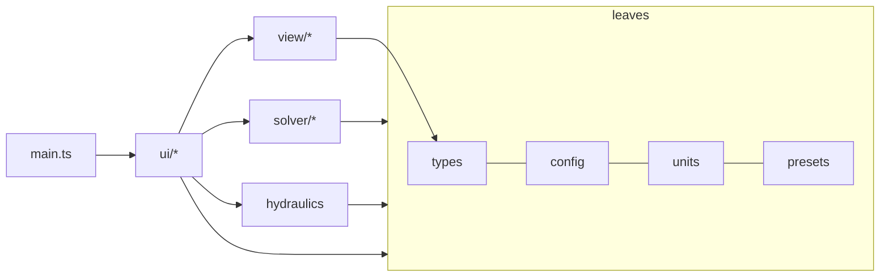
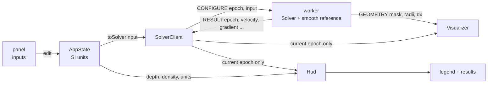

# wiertnictwo-cfd: architecture, data flow and maths

Interactive 3D visualisation of laminar axial flow in a drilling annulus, with real drilling-fluid rheology, wall roughness and a hydraulics read-out (pressure loss, ECD, bottom-hole pressure). A finite-difference solver runs in a Web Worker; Three.js draws the result.

**Control variable.** The user sets the **pump rate**. The solver finds the **frictional pressure gradient** that pushes exactly that flow through the annulus. Everything else (pressure loss, ECD, BHP, Reynolds number) follows from that gradient.

## 1. Architecture

```
src/
├── types.ts            shared types (SI units): Fluid, Geometry, SolverInput, SolveResult, worker messages
├── config.ts           numerical constants, allowed ranges
├── units.ts            field / SI display units and conversions
├── presets.ts          bit/pipe sizes, formation roughness, mud systems
├── hydraulics.ts       pure functions: ECD, pressures, Reynolds number
├── solver/
│   ├── rheology.ts     Herschel–Bulkley effective viscosity
│   ├── Solver.ts       grid, SOR + Picard iteration, flow-rate control
│   ├── cfd.worker.ts   owns the solve loop; streams results
│   └── SolverClient.ts main-thread handle: epochs, stale-result filtering
├── view/
│   ├── Visualizer.ts   Three.js chart (upsampled mesh) + translucent drill string / wellbore
│   └── turbo.ts        colormap
├── ui/
│   ├── state.ts        AppState (SI) and its conversion to SolverInput
│   ├── panel.ts        panel HTML and input bindings
│   └── hud.ts          legend and numeric results
├── main.ts             wiring only
└── panel.css, style.css
scripts/
├── check-solver.ts     numerical checks (analytic solutions, presets)
└── check-worker.ts     worker protocol checks
```

**Dependency rule.** Dependencies point downwards only: `types`/`config`/`units`/`presets` are leaves, `solver` and `hydraulics` depend on them but not on the UI, `view` depends on `types` only, `ui` depends on everything below it, and `main.ts` connects the pieces. The solver and the hydraulics can therefore be run and tested in Node without a browser (see section 8).



## 2. Data flow



1. **Edit.** An input handler writes an SI value into `AppState`, clamps it, refreshes all inputs (`sync`) and calls `onSolverChange`.
2. **Configure.** `main.ts` converts the state with `toSolverInput` and calls `SolverClient.configure`, which increments the epoch and posts `CONFIGURE`.
3. **Worker.** If the geometry or the resolution changed (diameters, eccentricity, roughness, solver resolution) it rebuilds the grid, restarts from rest and posts `GEOMETRY`. Fluid or flow-rate changes keep the velocity field as a **warm start**. The worker then loops: one solver step, post a `RESULT`, yield with `setTimeout(0)`. A new `CONFIGURE` is picked up between steps. The loop stops when converged or after `MAX_STEPS`.
4. **Results.** `SolverClient` drops results from older epochs. The current ones go to `Visualizer.updateData` (chart) and `Hud.setResult` (numbers). The HUD redraws at most once per animation frame.
5. **Hydraulics.** The HUD combines the gradient from the result with the depth and mud weight from the state (`computeHydraulics`). Hydraulics are never computed in the worker, so changing the depth or the units needs no re-solve.

### Message protocol

| Direction | Message | Content |
|---|---|---|
| main → worker | `CONFIGURE` | `{ epoch, input: { geometry, fluid, flowRateM3S, resolution } }` |
| worker → main | `GEOMETRY` | `{ gridSize, mask, radiusOuter, radiusInner, eccentricity, cellSizeM }` (radii in cells) |
| worker → main | `RESULT` | `{ epoch, velocity, converged, exhausted, gradientPaM, areaM2, plugFraction, referenceGradientPaM }` |

**Ordering rules.** `GEOMETRY` is never filtered: messages arrive in order, so the last one always describes the grid in use, and it is posted before the first `RESULT` that depends on it. `RESULT` is filtered by epoch, so numbers from a superseded configuration are never displayed.

## 3. Maths

### 3.1 Governing equation

Fully developed, steady, laminar axial flow of a generalised Newtonian fluid:

```
∇·(μ_eff ∇u) = −G        u = 0 on the wellbore wall and on the pipe
```

`u` [m/s] is the axial velocity, `G` [Pa/m] the frictional pressure gradient, `μ_eff` [Pa·s] the effective viscosity. Gravity does not appear: in a vertical well the hydrostatic pressure gradient balances the weight of the mud and does not drive the flow.

### 3.2 Rheology

All supported models are special cases of **Herschel–Bulkley**, `τ = τ_y + K·γ̇ⁿ`:

| Model | τ_y | K | n |
|---|---|---|---|
| Newtonian | 0 | μ | 1 |
| Bingham plastic | YP | PV | 1 |
| Herschel–Bulkley (and power law with τ_y = 0) | τ_y | K | n |

The effective viscosity is `μ_eff = K·γ̇^(n−1) + τ_y/γ̇`, with the shear rate floored at `MIN_SHEAR_RATE = 1 s⁻¹`. Below the floor the fluid behaves as a very viscous Newtonian fluid (bi-viscous regularisation): the unyielded plug becomes a nearly rigid, slowly shearing region, and a shear-thinning fluid gets a finite viscosity plateau. Lowering the floor to 0.1 s⁻¹ changed the pressure gradient by less than 0.5 % in the checks but made the solver about four times slower.

**Unyielded area** is the fraction of fluid cells whose shear rate is below the floor (fluids with τ_y > 0 only).

### 3.3 Discretisation

Finite volumes on a square grid. The wellbore always fills the grid the same way, whatever its physical size; only the number of cells across the wellbore radius `R` depends on the selected **resolution**:

| Resolution | `R` (cells) | Grid | Relative run time |
|---|---|---|---|
| Standard | 40 | 100 × 100 | 1× |
| High | 64 | 160 × 160 | about 2× |
| Fine | 96 | 240 × 240 | about 4× |

Viscosity lives on the **cell faces**:

```
Σ_faces μ_f (u_nb − u_i) + G·dx² = 0     →     u_i = (Σ μ_f u_nb + G·dx²) / Σ μ_f
```

- **Face shear rate** = `√(normal² + transverse²)`: the normal difference across the face and the transverse gradient averaged over the two cells. This makes the stress `μ_f·∂u/∂n` in the flux consistent with `μ_eff(|∇u|)`. A cell-centred estimate was tried first and under-predicted the yield stress badly.
- **Face viscosity** is evaluated from the current velocity once per step (Picard iteration) and frozen during the sweeps. Updating it every sweep was slower.
- **Walls.** Cells outside the fluid hold `u = 0`. The first non-fluid cell sits on average half a cell beyond the fluid edge, so the fluid edge is moved **inwards by 0.5 cell** on both walls (`distOuter < Ro − 0.5`, `distInner > Ri + 0.5`). Without that shift the effective gap was about one cell too wide and the pressure gradient 11 % too low.
- **Solver.** SOR with the theoretical optimum `ω = 2 / (1 + sin(π / 2R))` (1.92, 1.95, 1.97 for the three resolutions), 30 sweeps per step. A fixed ω = 1.8 made the fine grid fail to converge in time; the optimum made every case converge in about half the steps.

### 3.4 Flow-rate control

With the viscosity frozen the problem is linear in `G`: `u = G·w`. After each step the solver measures `Q = Σu·dx²` and scales **u and G by the same factor** `Q_target/Q`. For Newtonian fluids that is exact (the solution is found in a handful of steps); for non-Newtonian fluids the iteration of "scale, update viscosity, sweep" is a fixed-point iteration that converged for all presets.

Convergence criterion: the largest relative change of `u` over one step is below `CONVERGENCE_TOL = 1e-5`.

### 3.5 Wall roughness (formations)

Rough or irregular formations drag more than a smooth wall. A thin layer of flow resistance next to the **wellbore wall** (not the pipe) adds `drag·μ_mean` to the diagonal:

```
u_i = (Σ μ_f u_nb + G·dx²) / (Σ μ_f · (1 + drag_i/4)),     drag_i = WALL_DRAG · coverage_i
```

- Layer thickness is `ε = (ε/D)·D`, i.e. `ε/D · 2R` cells; `coverage_i` is the fraction of cell `i` inside the layer. For `ε/D = 0` all drag is 0.
- `WALL_DRAG = 2` is a tuning constant. For a Newtonian fluid this is exactly the `(4 + drag)` form of the plain 5-point stencil.
- **Reference solve.** While `ε/D > 0` the worker also solves the same problem with smooth walls and the same flow rate. The HUD reports `G_rough / G_smooth − 1`: how much more pressure the formation costs at the same pump rate.

The formation presets are **effective, illustrative** roughness values. Calibrate them against caliper logs or measured pressure losses.

## 4. Hydraulics

Assumptions (stated once, in `hydraulics.ts`): vertical well, TVD = depth, mud pumped up the annulus, no surface back-pressure, no temperature or pressure dependence of the mud.

| Quantity | Definition |
|---|---|
| Mean velocity | `v = Q / A`, `A = π/4 (D² − d²)` |
| Friction loss | `ΔP_f = G · L` |
| Hydrostatic | `P_h = ρ g L` |
| Circulating BHP | `P_h + ΔP_f` |
| ECD | `ρ + G / g` (the friction gradient expressed as extra mud density) |
| Wall shear stress | `τ_w = G·A / (π (D + d))` (mean over both walls) |
| Apparent viscosity | `μ_app = G h² / (12 v)`, `h = (D − d)/2`: the Newtonian viscosity that would give the same pressure loss in a narrow slot |
| Reynolds number | `Re = ρ v (2h) / μ_app` |

`Re` is a screening criterion. Above `RE_LIMIT = 2100` the HUD warns that the flow is probably turbulent and that the laminar solution **underestimates** the pressure loss. Fresh water and base oil are always above it at normal pump rates.

### Why the 3D pressure view was removed

The old view drew a tube coloured by `p/p_inlet`. That quantity is dimensionless, linear by construction and independent of the mud, so it could not respond to the fluid, the depth or the flow rate. The numbers above carry the real information. A depth profile would be two nearly parallel lines (friction is typically 2 to 5 % of the hydrostatic pressure), so it was not worth a chart.

## 5. Rendering and quality

The chart is a height field over the cross-section: height and colour (turbo colormap) are both `field / max`, where `field` is the axial velocity [m/s] or the shear rate `|∇u|` [1/s] (central differences). Rock is flat and dark, the pipe flat and steel-coloured.

**Display smoothing** (view only, no re-solve). The mesh is finer than the solver grid:

- every solver cell is split into `s × s` render cells (`s` = 1, 2 or 4);
- the field is interpolated **bilinearly**;
- the wellbore and pipe edges are the **exact circles** (`radiusOuter`, `radiusInner`, eccentricity) evaluated per render vertex, instead of the solver's staircase mask. The solver puts its no-slip nodes on the nominal walls (section 3.3), so the interpolated velocity reaches zero at the drawn wall;
- the shear rate peaks at the walls, so the one-cell ring of wall nodes is filled with the nearest fluid values before interpolation. Zeros there would pull the drawn shear down exactly where it is largest;
- colours come from a 256-entry table.

The mesh is capped at 400 vertices per side (160 k vertices), which can still be rebuilt every frame while the solver streams results. On the fine solver grid the effective smoothing is therefore reduced automatically (4× at standard, 2× at high, 1× at fine).

**Solver resolution** changes the solution itself, but less than one might expect: in the checks the Bingham pressure gradient moved by about 1–2 % between standard and fine, and the Newtonian error against the exact solution went from 3.5 % to 1.9 %. It matters most for narrow gaps and for the shape of the yield-stress plug.

**Tube length** scales the two cylinders along the well axis, centred on the chart, up to 6× its height. It is purely visual: the flow is fully developed, so nothing changes along the axis.

## 6. Units

All state and all solver data are SI. `units.ts` converts only at the UI edge.

| Quantity | Field | SI |
|---|---|---|
| Diameter | in | mm |
| Depth | ft | m |
| Pump rate | gpm | L/min |
| Pressure | psi | bar |
| Mud weight / ECD | ppg | kg/m³ |
| Pressure gradient | psi/100ft | kPa/m |
| Velocity | ft/min | m/min |

Rheology parameters are always entered in Pa and Pa·sⁿ. Mud-report values convert as `1 cP = 0.001 Pa·s` and `1 lb/100ft² = 0.4788 Pa`; the presets already contain them converted.

## 7. UI parameters

| Control | Range | Effect |
|---|---|---|
| Bit / pipe preset | 4 common sizes | Sets both diameters |
| Wellbore Ø | 3–26 in | Cell size and flow area |
| Drill pipe OD | 10–90 % of wellbore Ø | Shape of the annulus |
| Eccentricity | 0–0.95 | Shifts the pipe toward the wall |
| Pump rate | 8–3200 gpm | Control variable of the solver |
| Well depth (TVD) | 100–10 000 m | Pressures and ECD only (no re-solve) |
| Base, mud system | water / oil + presets | Fills the fluid fields; the base itself has no effect on the equations |
| Rheology | Newtonian, Bingham, Herschel–Bulkley | Which of τ_y, K, n are used |
| Mud weight | 5–25 ppg | Pressures, ECD, Reynolds number (does not change the flow field) |
| Formation, roughness ε/D | 8 presets, 0–15 % | Wall resistance layer |
| Drill string / wellbore | on/off + opacity | Translucent cylinders around the chart |
| Tube length | 1–6× | Length of both cylinders (visual only) |
| Display smoothing | off, 2×, 4× | Render mesh density (view only) |
| Solver resolution | standard, high, fine | Cells per wellbore radius: 40, 64, 96 |

The mud **base** (water or oil) only selects the preset list. The physical difference between the two is carried by the rheology and the density.

## 8. Verification

```
npm i -D tsx
npx tsx scripts/check-solver.ts
npx tsx scripts/check-worker.ts
```

| Check | Result |
|---|---|
| Newtonian concentric annulus vs the exact solution (`Q = πG/(8μ)·[b⁴ − a⁴ − (b² − a²)²/ln(b/a)]`) | within 3.5 % (staircase walls at 40 cells per radius) |
| Newtonian: `G` linear in `Q` and in `μ` | exact to 4 digits |
| Eccentric annulus needs less pressure than concentric | yes (0.8: about half) |
| Bingham, `d/D = 0.8`, vs the narrow-slot formula | within about 9 % (the slot formula itself is approximate there) |
| All 11 mud presets converge | 35–195 steps, 0.1–0.4 s for the yield-stress muds, under 0.05 s for the others |
| Roughness raises the pressure gradient | yes (+74 % at 5 % ε/D, Newtonian) |
| Warm start after a fluid change | 86 steps vs 192 from rest |
| Higher resolutions | converge; Bingham gradient within 2 % of standard; fine solves in about 2 s |
| Worker: message order, epoch filtering, reconfigure mid-solve, reference solver on/off | all pass |

## 9. Limitations and ideas

- **Laminar only.** Above `Re ≈ 2100` the pressure loss is underestimated. A turbulent correlation (for example Metzner–Reed with a Dodge–Metzner friction factor) could be added in `hydraulics.ts` as a second estimate for comparison.
- **Effective wall roughness.** The resistance layer is a tuned model, not a Colebrook-type roughness.
- **Staircase walls.** Circles are voxelised on the solver grid, so the discretisation error is a few per cent (and not monotonic in the resolution). Narrow gaps (`d/D` near 0.9) have few fluid cells across; use a higher resolution there. The drawn walls are exact, the solved ones are not.
- **No pipe rotation, no axial variation, no cuttings, no temperature or pressure dependence of the mud.**
- **Vertical well.** Inclination would add `ρ g cosθ` to the hydrostatic term only; the flow solution does not change.
- **Restart on geometry change.** Warm start is used for fluid and pump-rate changes only.
- **Possible extra view:** the effective viscosity field, which shows the plug and the shear-thinning directly. The worker would send one more array.