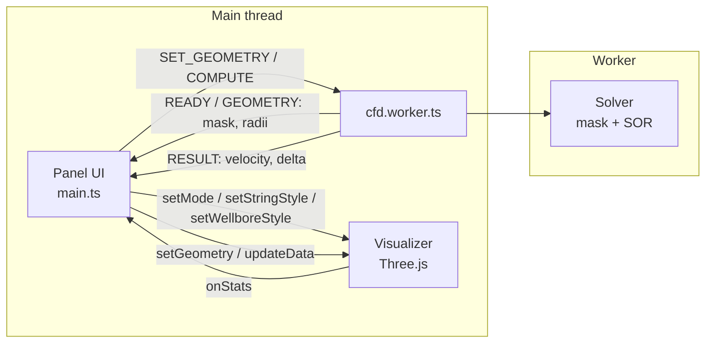
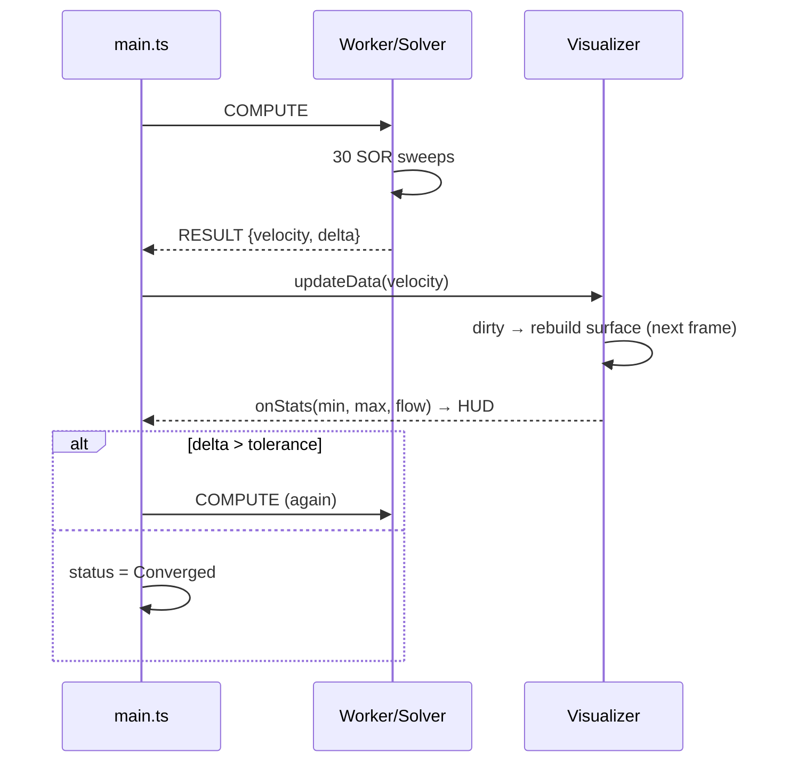

# wiertnictwo-cfd: architecture and data flow

Interactive 3D visualisation of laminar axial flow in a drilling annulus (the gap between the drill string and the wellbore wall). A finite-difference solver runs in a Web Worker; Three.js renders the result on the main thread.

## 1. Overview

| Layer | File | Responsibility |
|---|---|---|
| Config | `src/config.ts` | Shared constants, allowed ranges, presets, UI defaults |
| UI / orchestration | `src/main.ts` | Panel HTML, state, unit handling, worker messaging, HUD |
| Solver | `src/solver/Solver.ts` | Geometry mask + SOR solution of the Poisson equation |
| Worker wrapper | `src/solver/cfd.worker.ts` | Message protocol between main thread and solver |
| Rendering | `src/view/Visualizer.ts` | Surface chart, tubes, layer opacity, camera, stats |
| Styling | `src/style.css`, `src/panel.css` | Page and panel styles |



## 2. Physical and numerical model

Fully developed, steady, laminar flow of a Newtonian fluid along the well axis `z`. Only the axial velocity `u(x, y)` is non-zero, and it satisfies

```
∇²u = −G/μ        G = −dp/dz (constant),  μ = viscosity
u = 0 on the wellbore wall and on the drill pipe (no-slip)
```

Discretisation on a 100 × 100 grid (`GRID_SIZE`), 5-point stencil:

```
u[i] = ¼ (u[i−1] + u[i+1] + u[i−N] + u[i+N] + f),     f = G·dx²/μ = 0.05
```

It is solved with SOR (`omega = 1.8`), 30 sweeps per `COMPUTE` call. The residual is the largest change in the last sweep (`delta`). The loop stops once `delta < 1e-6`.

**Geometry mask** (`Uint8Array`, one value per cell):

| Value | Meaning | Treatment |
|---|---|---|
| 0 | fluid | solved |
| 1 | rock (outside wellbore) | `u = 0` |
| 2 | drill pipe | `u = 0` |

The wellbore is a circle centred in the grid. The pipe is a smaller circle shifted along +x by `e = eccentricity · (Ro − Ri)`. `eccentricity = 0` is concentric and `1` would touch the wall (the UI caps it at 0.95).

### Diameters and normalisation

The wellbore always spans `OUTER_RADIUS_CELLS = 40` cells, so resolution is the same for every size. The physical diameters therefore enter in two ways:

1. **Shape:** only the ratio `d/D = pipe OD / wellbore Ø` goes to the solver (`radiusInner = 40 · d/D`).
2. **Scale:** the HUD converts the cell-unit results into dimensionless or physical-scaled quantities.

| HUD value | Definition |
|---|---|
| Velocity legend `u*` | `u·μ / (G·R²)`, with `R` the wellbore radius. A full circle gives a peak of 0.25. |
| Shear legend `\|∇u\|*` | `\|∇u\|·μ / (G·R)` |
| `Q·μ/G` | `dx⁴ · Σu_cell / f` in `in⁴` or `mm⁴`, with `dx = R / 40`. It scales with `D⁴`, so changing the wellbore diameter changes this number even though the picture looks the same. |

Because the viscosity and pressure gradient are not parameters, absolute velocities are not shown. Multiply `u*` by `G·R²/μ` for a given fluid.

### 2.2 Wellbore wall friction (formations)

Rough or irregular formations drag on the flow more than a smooth wall does. This is modelled as a thin layer of flow resistance next to the **wellbore wall** (a Darcy–Brinkman term). The drill pipe stays smooth steel.

```
∇²u − (c/dx²)·u = −G/μ     →     u[i] = (Σ neighbours + f) / (4 + c[i])
c[i] = WALL_DRAG · coverage[i]
```

- Layer thickness is the effective roughness `ε = (ε/D) · D`, which is `ε/D · 80` cells, because the wellbore diameter is 80 cells.
- `coverage[i]` (0..1) is the fraction of cell `i` inside that layer. With `ε/D = 0` every `c` is 0 and the solver reduces to the original stencil.
- `WALL_DRAG = 2` (`config.ts`) is a tuning constant. It sets how strongly a fully covered cell is slowed.
- **Reference solve:** while `ε/D > 0` the worker also advances a second `Solver` with the same geometry and smooth walls, until it converges. `RESULT.referenceFlow` carries its flow, and the HUD shows `Q change = flow / referenceFlow − 1` once both solutions have converged. At `ε/D = 0` no reference runs and the HUD says "smooth (reference)".

**Formation presets** (`FORMATIONS` in `config.ts`):

| Formation | ε/D |
|---|---|
| Smooth / gauge hole | 0 % |
| Salt | 0.5 % |
| Limestone / dolomite | 1 % |
| Shale | 2 % |
| Sandstone | 3 % |
| Unconsolidated sand | 5 % |
| Fractured / vuggy carbonate | 7 % |
| Washout / caved zone | 10 % |

These are **effective, illustrative** values that lump micro-roughness and hole irregularity together. They are not measured constants. Calibrate them with caliper logs or measured pressure losses. The model is laminar and Newtonian, so it does not reproduce turbulent roughness correlations (Colebrook and similar).

## 3. Data flow

### 3.1 Start-up

1. `main.ts` builds the panel from `state`, which is initialised from `DEFAULTS` in `config.ts`.
2. It creates the `Visualizer` and the worker.
3. It sends `INIT { size, diameterRatio, eccentricity }`.
4. The worker creates the `Solver` and builds the mask, then replies `READY { mask, radiusOuter, radiusInner, eccentricity }`.
5. `main.ts` calls `visualizer.setGeometry(...)` and then `requestCompute()`.

### 3.2 Solve loop



At most one `COMPUTE` is in flight (`computeBusy`). Buffers are transferred, not copied, so each result is cheap to hand over.

### 3.3 Changing a parameter

1. The user edits a diameter (on change), picks a preset, or drags eccentricity.
2. `setDiameters` clamps the values (wellbore 3–26 in, pipe 10–90 % of wellbore Ø) and shows a notice if it had to adjust them.
3. `requestGeometry()` sends `SET_GEOMETRY { diameterRatio, eccentricity, roughness }`. While one request is in flight, newer values are coalesced into a single follow-up (`geometryDirty`), so slider drags do not flood the worker.
4. The worker rebuilds the mask, **resets `u` to zero** and replies `GEOMETRY`.
5. `Visualizer.setGeometry` stores the mask, replaces the velocity with a zero field, so the new walls appear immediately, and rebuilds the tubes. `main.ts` then starts a new solve loop.

Messages are processed in order by the worker, so a `RESULT` can never arrive for a geometry other than the one the visualiser currently holds. A stale `RESULT` that arrives while a geometry request is pending is rendered but does not trigger another compute.

### 3.4 Message protocol

| Direction | `type` | Payload |
|---|---|---|
| main → worker | `INIT` | `{ size, diameterRatio, eccentricity, roughness }` |
| main → worker | `SET_GEOMETRY` | `{ diameterRatio, eccentricity, roughness }` (`roughness` = ε/D as a fraction) |
| main → worker | `COMPUTE` | none |
| worker → main | `READY` / `GEOMETRY` | `{ mask, radiusOuter, radiusInner, eccentricity }` (radii in cells) |
| worker → main | `RESULT` | `{ velocity: Float64Array, delta, referenceFlow }` (`delta` is the max of the rough and smooth solves; `referenceFlow` is `null` when ε/D = 0) |

## 4. Rendering

World scale is 0.05 units per cell. The z axis is up, like a vertical well.

### 4.1 Views

| View | What is drawn |
|---|---|
| Velocity / Shear | A height-field surface over the cross-section. Height and colour (turbo colormap) are both `field / max`. Rock cells are flat and dark, pipe cells flat and steel-coloured. Shear is `\|∇u\|` by central differences. |
| Pressure | Two vertical cylinders (wellbore wall seen from inside, drill pipe) coloured by pressure, from 1 at the bottom (inlet) to 0 at the top (outlet), plus end caps. Pressure is linear because `dp/dz` is constant. |

### 4.2 Drill string and wellbore layers

Two cylinders are built per geometry, one for the wellbore wall (radius `Ro`, centred) and one for the drill string (radius `Ri`, offset by the eccentricity). Each has two materials, swapped in `applyStyle()`:

| Layer | Velocity / Shear view | Pressure view |
|---|---|---|
| Drill string | Silver (`0xc8ccd2`), translucent | Pressure-coloured |
| Wellbore wall | Brown (`0x8b5a2b`), translucent | Pressure-coloured |

- Each layer has a visibility checkbox and an opacity slider (5–100 %).
- In chart views the cylinders are squashed with `mesh.scale.z` to the chart height, so they enclose the surface exactly. The same geometry is reused for the pressure view.
- Layers with opacity below 99 % do not write depth (`depthWrite = false`) and render after the opaque chart (`renderOrder = 1`), so the chart stays visible through them.
- The end caps appear only in the pressure view.

## 5. UI parameters

| Control | Range | Effect |
|---|---|---|
| Preset | Custom + 4 common bit/pipe sizes | Sets both diameters |
| Unit | in / mm | Display and input unit only. Internal storage is mm. |
| Wellbore Ø | 3–26 in | Scales `Q`. Changes the shape only through `d/D`. |
| Drill pipe OD | 10–90 % of wellbore Ø | Changes `d/D` and therefore the shape |
| Eccentricity | 0–0.95 | Shifts the pipe toward the wall |
| Formation | Custom + 8 presets | Sets the wall roughness (see 2.2) |
| Roughness ε/D | 0–15 % | Thickness of the wall resistance layer; lowers Q and flattens the profile near the wall |
| Drill string / Wellbore | on/off + opacity | See 4.2 |

## 6. Limitations and ideas

- **Friction model is effective.** Wall friction is a resistance layer with a tuned strength, not a turbulent roughness correlation. Use it to compare formations qualitatively.
- **Newtonian only.** Real drilling muds are shear-thinning (Bingham or Herschel–Bulkley). A viscosity field `μ(|∇u|)` would fit into the same SOR loop with an outer iteration.
- **Staircase walls.** Circles are voxelised, so wall shear is approximate. 40 cells per radius is a compromise between speed and accuracy.
- **No pipe rotation, no axial variation.** Flow is purely axial and fully developed.
- **Restart on every change.** The field is reset to zero when the geometry changes. A warm start from the previous field would converge faster for small slider moves.
- **Pressure view is schematic.** It shows the linear pressure profile, not a solved pressure field.
